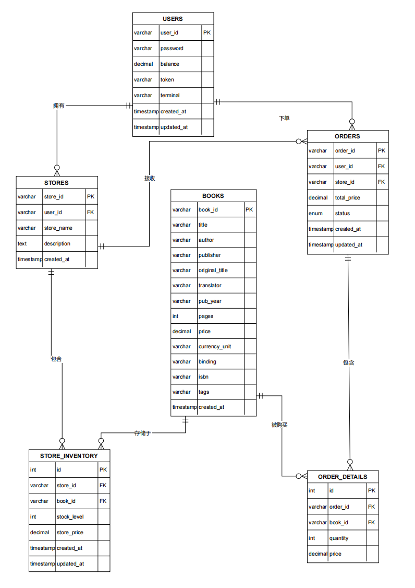
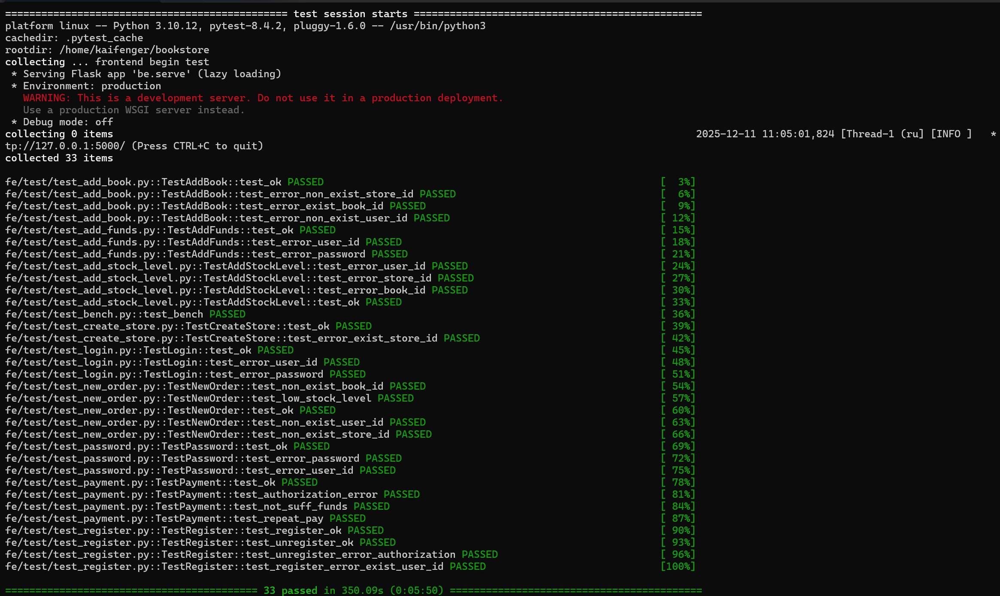
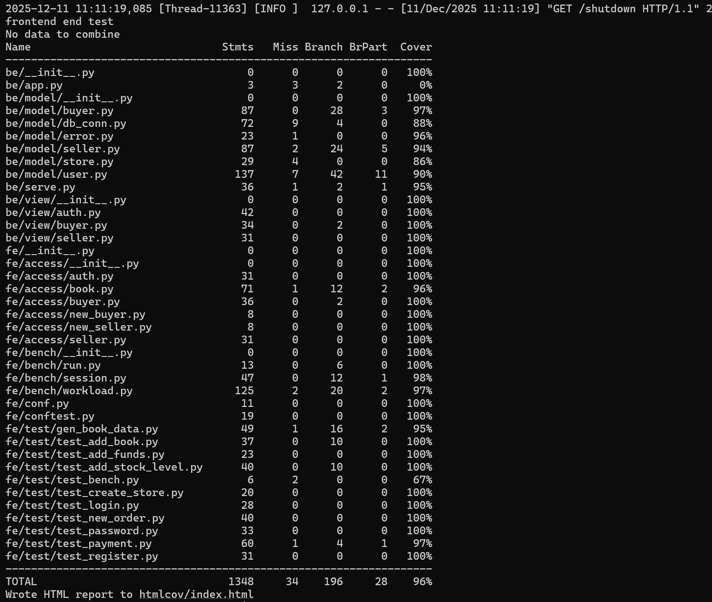
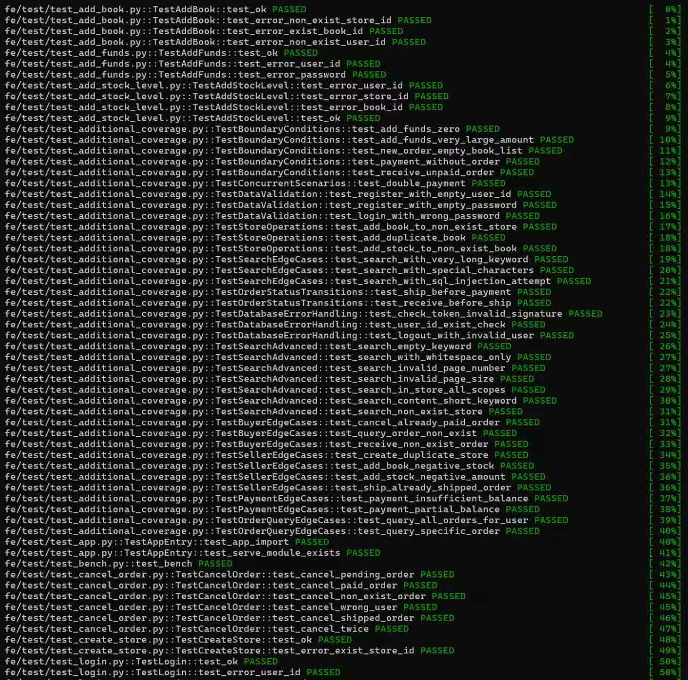
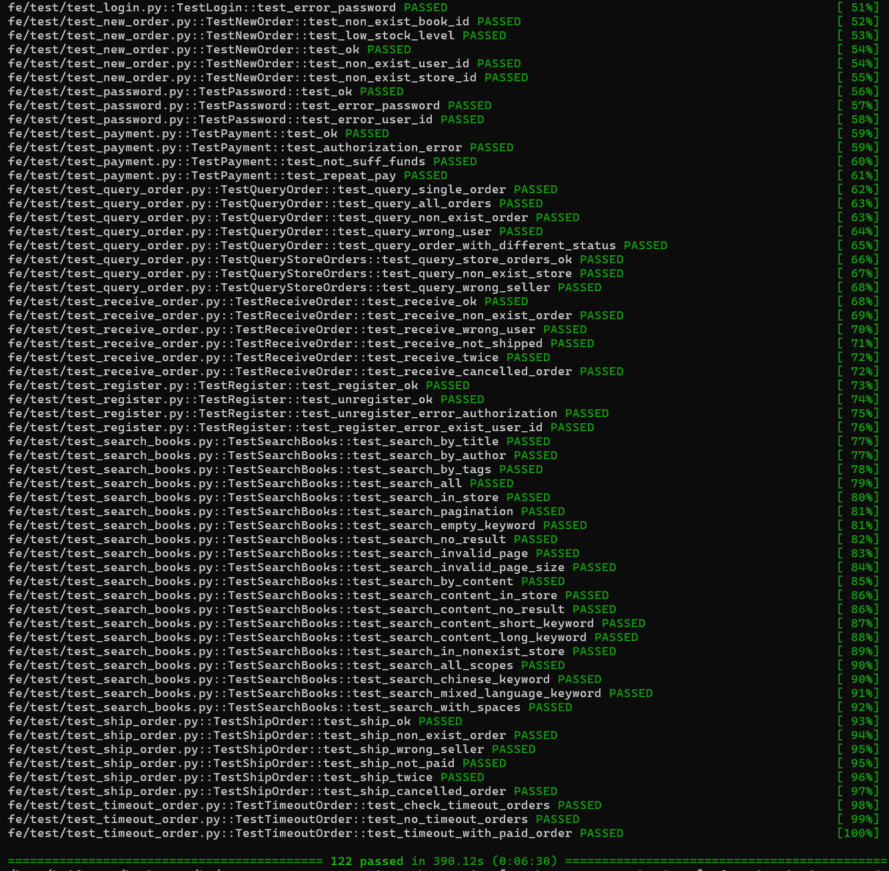
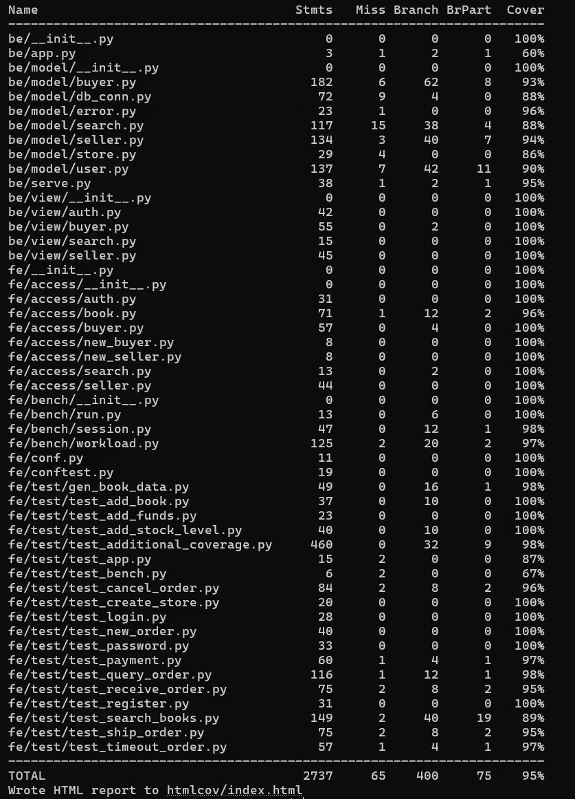
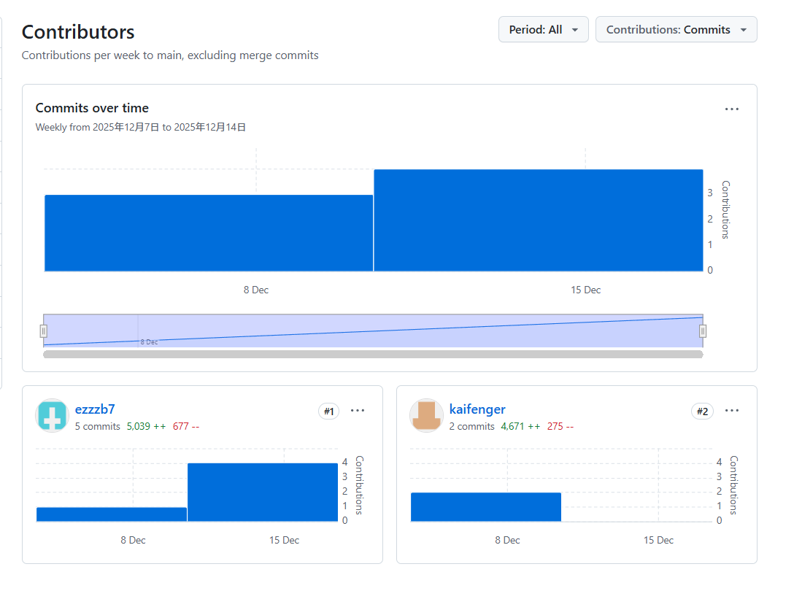
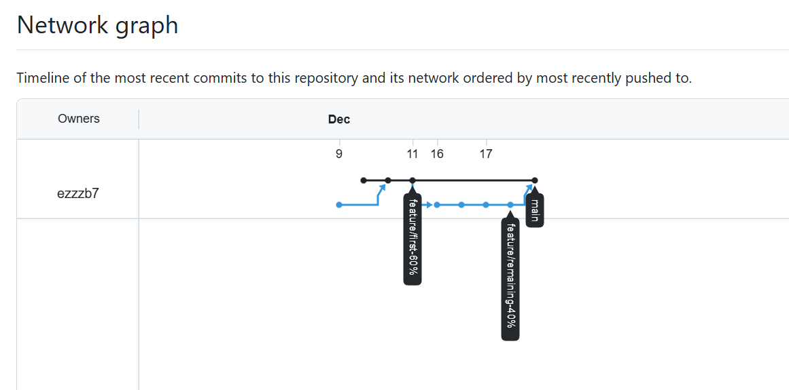
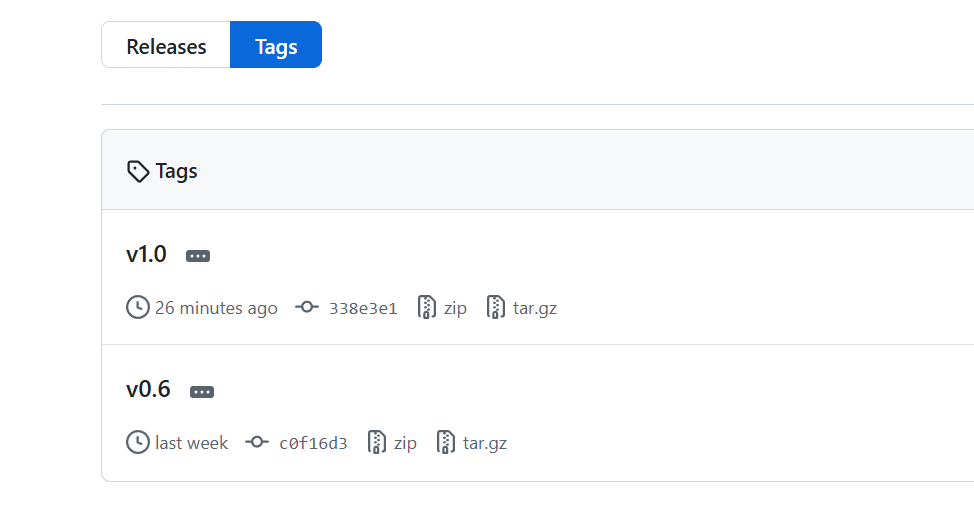

## <center> 当代数据管理系统第二次大作业--书店</center>
### 小组成员
10235501452 肖璟仪
10235501435 张凯诚

**分工说明：**
- **张凯诚**：负责实现前60%基础功能
- **肖璟仪**：负责实现后40%附加功能以及对应的测试用例。
- **共同完成**：数据库架构设计（从MongoDB到MySQL+MongoDB混合架构的迁移）、数据库优化（索引优化、全文搜索）、项目整体测试与调试、实验报告撰写。

### 1. 实验要求

**功能**
- 实现一个提供网上购书功能的网站后端。
- 网站支持书商在上面开商店，购买者可以通过网站购买。
- 买家和卖家都可以注册自己的账号。
- 一个卖家可以开一个或多个网上商店，
- 买家可以为自已的账户充值，在任意商店购买图书。
- 支持 下单->付款->发货->收货 流程。
**1.实现对应接口的功能：（60%）**
其中包括：
1)用户权限接口，如注册、登录、登出、注销
2)买家用户接口，如充值、下单、付款
3)卖家用户接口，如创建店铺、填加书籍信息及描述、增加库存
通过对应的功能测试，所有 test case 都 pass 
**2.为项目添加其它功能 ：（40%）**
1)实现后续的流程 ：发货 -> 收货
2)搜索图书 
- 用户可以通过关键字搜索，参数化的搜索方式；
- 如搜索范围包括，题目，标签，目录，内容；全站搜索或是当前店铺搜索。
- 如果显示结果较大，需要分页
- (使用全文索引优化查找)
3)订单状态，订单查询和取消定单
- 用户可以查自已的历史订单，用户也可以取消订单。
- 取消定单可由买家主动地取消定单，或者买家下单后，经过一段时间超时仍未付款，定单也会自动取消。 
### 2. 混合数据库架构设计
#### 2.0 从文档型数据库到混合架构的演进
##### 2.0.1 文档型数据库
第一次作业的bookstore项目使用纯MongoDB文档数据库，所有数据（用户、订单、库存、图书信息）都存储在MongoDB中。

**存在的问题：**
1. **缺乏事务支持**：MongoDB在4.0之前不支持多文档事务，订单创建、库存扣减、余额变动无法保证原子性
2. **关联查询困难**：用户-订单-商店-图书的多表关联需要多次查询或使用$lookup，性能较差
3. **数据一致性弱**：无外键约束，数据完整性依赖应用层保证
4. **BLOB数据影响性能**：大文本和图片混在业务数据中，导致查询变慢
##### 2.0.2 改进方案（MySQL+MongoDB混合架构）

**改动内容：**
- **MySQL存储核心业务数据**：users, stores, orders, store_inventory等表
- **MongoDB存储BLOB数据**：book_details集合存储图书详细介绍、图片等

**改动理由：**

1. **事务支持**：MySQL的ACID特性保证订单创建、支付、库存扣减的原子性
2. **性能提升**：外键索引、复合索引、全文索引大幅提升查询速度
3. **业务逻辑简化**：SQL的JOIN操作简化多表关联查询，代码更清晰
4. **数据分离**：BLOB数据分离到MongoDB，避免拖慢MySQL查询性能
5. **数据完整性**：外键约束保证引用完整性，级联删除自动维护数据一致性
#### 2.1 架构概述
本项目采用 **MySQL + MongoDB 混合数据库架构**：
- **MySQL（关系型数据库）**：存储核心业务数据（用户、商店、订单、库存）
- **MongoDB（NoSQL数据库）**：存储BLOB数据（图书详细介绍、作者介绍、图片等）

#### 2.2 业务逻辑图
| **1. 用户管理模块<br>(user.py)**                                                             | **2. 买家功能模块<br>(buyer.py)**                                                                                                                                                                      | **3. 卖家功能模块<br>(seller.py)<br>**                                                     | **4. 数据库连接模块<br>(db_conn.py)**                                                                                                                                                       |
| -------------------------------------------------------------------------------------- | ------------------------------------------------------------------------------------------------------------------------------------------------------------------------------------------------ | ------------------------------------------------------------------------------------ | ------------------------------------------------------------------------------------------------------------------------------------------------------------------------------------ |
| **基础功能：**<br>- 注册(register)<br>- 登录(login)<br>- 登出(logout)<br>- 注销(unregister)<br><br> | **基础功能：**<br>- 账户充值(add_funds)<br>- 创建订单(new_order)<br>- 订单付款(payment)<br><br>                                                                                                                   | **基础功能：**<br>- 创建店铺(create_store)<br>- 添加图书(add_book)<br>- 库存管理(add_stock_level)<br> | **全文搜索索引：**(`create_search_indexes`)<br>- 覆盖字段：title/author/tags/content<br>- 核心能力：中文分词、模糊匹配<br>                                                                                     |
| **扩展功能：**<br>- 修改密码(change_password)                                                   | **扩展功能：**<br>- 订单查询(search_order)<br>- 取消订单(cancel_order)<br>- 自动取消(trigger_auto_cancel)<br>- 确认收货(receive_order)<br>- 图书搜索(search_books)<br>- 高级搜索(advanced_search)<br>- 热门图书(search_hot_books) | **扩展功能：**<br>- 订单发货(ship_order)<br>- 资金管理(add_funds)                                 | **数据库管理：**<br>- MySQL连接池管理<br>- MongoDB连接管理<br>- user_id_exist()<br>- store_id_exist()<br>- book_id_exist()<br><br>**索引优化：**<br>- MySQL全文索引(FULLTEXT)<br>- 订单状态和时间复合索引<br>- 外键索引自动创建 |
#### 2.3 ER图设计

**实体及属性：**
- **User（用户）**：user_id(PK), password, balance, token, terminal
- **Store（商店）**：store_id(PK), user_id(FK), store_name, description
- **Book（图书）**：book_id(PK), title, author, publisher, price, isbn, tags
- **Order（订单）**：order_id(PK), user_id(FK), store_id(FK), total_price, status
- **StoreInventory（库存）**：id(PK), store_id(FK), book_id(FK), stock_level, store_price
- **OrderDetail（订单详情）**：id(PK), order_id(FK), book_id(FK), quantity, price

**关系：**
- User 1:N Store（一个用户可开多个商店）
- Store 1:N StoreInventory（一个商店有多个库存记录）
- Book 1:N StoreInventory（一本书可在多个商店销售）
- User 1:N Order（一个用户可下多个订单）
- Order 1:N OrderDetail（一个订单包含多个商品）
- Book 1:N OrderDetail（一本书可在多个订单中）
#### 2.4 MySQL表结构设计（核心业务数据）

本项目采用MySQL存储核心业务数据，设计6张关系型数据表。详细DDL见附录A。

**表结构：**

| 表名 | 说明 | 主键 | 主要字段 |
|------|------|------|---------|
| **users** | 用户表 | user_id | password, balance, token, terminal |
| **stores** | 商店表 | store_id | user_id(FK) |
| **books** | 图书表 | book_id | title, author, publisher, price, isbn, tags |
| **store_inventory** | 库存表 | id | store_id(FK), book_id(FK), stock_level, store_price |
| **orders** | 订单表 | order_id | user_id(FK), store_id(FK), total_price, status, created_at |
| **order_details** | 订单详情表 | id | order_id(FK), book_id(FK), quantity, price |

**设计说明：**

1. **外键约束** - 保证数据完整性
   - stores.user_id → users.user_id（级联删除）
   - store_inventory → stores, books
   - orders → users, stores
   - order_details → orders（级联删除）, books

2. **索引设计** - 优化查询性能
   - 全文索引：books(title, author, tags) - 支持图书搜索
   - 复合索引：orders(user_id, status, created_at) - 优化订单查询
   - 复合索引：orders(status, created_at) - 支持超时订单查询
   - 唯一索引：store_inventory(store_id, book_id) - 防止重复库存记录

3. **订单状态管理**
   - 使用ENUM类型：pending, paid, shipped, delivered, cancelled
   - created_at字段自动记录时间戳，支持超时判断

#### 2.5 MongoDB集合设计（BLOB数据）

MongoDB存储图书的详细描述信息，避免影响MySQL查询性能。

| 集合名 | 说明 | 主要字段 |
|--------|------|---------|
| **book_details** | 图书详细信息 | book_id, book_intro, author_intro, content, picture |

**索引设计：**
- book_id唯一索引
- (book_intro, content, author_intro)文本索引，支持中文全文搜索

**数据分离策略：** MySQL存储基本信息，MongoDB存储BLOB数据，通过book_id关联。

#### 2.6 混合架构设计优势

**1. 数据库选型合理，各司其职**

- **MySQL负责核心业务数据**：用户、订单、库存等需要强一致性和事务支持的数据存储在MySQL中，利用其ACID特性保证数据准确性
- **MongoDB负责BLOB数据**：图书详细介绍、作者介绍、目录内容等大文本和图片数据存储在MongoDB中，避免MySQL性能下降

**2. 索引优化，保障高性能检索**

- **MySQL索引策略**：
  - 主键索引：所有表主键自动创建聚簇索引
  - 外键索引：自动在外键字段创建索引，提高JOIN性能
  - 全文索引：在books表的title、author、tags字段创建FULLTEXT索引，支持中文搜索
  - 复合索引：订单表创建(user_id, status, created_at)复合索引，优化订单查询

- **MongoDB索引**：在book_id字段创建索引，快速关联MySQL中的图书基础信息

**3. 事务支持，保证数据一致性**

MySQL的事务机制确保订单创建、支付、库存扣减等操作的原子性。例如：
- 下单时：同时创建订单记录、订单详情和扣减库存，三个操作要么全成功要么全失败
- 支付时：买家扣款和卖家收款在同一事务中完成，避免资金不一致

**4. 连接池管理，提升并发性能**

采用MySQL连接池技术（pool_size=10），复用数据库连接，减少连接创建销毁开销，支持高并发访问。

**5. 数据分离与解耦**

图书基础信息（标题、作者、价格等）存储在MySQL，详细描述、图片等BLOB数据存储在MongoDB。查询库存和订单时无需加载大字段，提升查询效率。

### 3. 基本功能实现（60%）
#### 3.0 数据库初始化与数据迁移

本项目采用MySQL+MongoDB混合架构，需要进行数据库初始化和数据迁移。我们设计并实现了两个脚本：`init_database.py`（数据库初始化）和`migrate_to_mysql.py`（数据迁移）。

##### 3.0.1 数据库初始化（init_database.py）

首先，需要初始化MySQL数据库结构，创建所有业务表：

```python
def init_mysql_database():
    """初始化MySQL数据库和表结构"""
    conn = mysql.connector.connect(
        host=os.getenv('MYSQL_HOST', 'localhost'),
        port=int(os.getenv('MYSQL_PORT', 3306)),
        user=os.getenv('MYSQL_USER', 'root'),
        password=os.getenv('MYSQL_PASSWORD', '123456'),
        charset='utf8mb4'
    )
    cursor = conn.cursor()
    
    # 创建数据库
    cursor.execute("CREATE DATABASE IF NOT EXISTS bookstore CHARACTER SET utf8mb4 COLLATE utf8mb4_unicode_ci")
    cursor.execute("USE bookstore")
```

创建用户表、商店表、图书表、库存表、订单表等核心业务表，并设置外键约束和索引。同时初始化MongoDB用于存储BLOB数据：

```python
def init_mongodb():
    """初始化MongoDB数据库和集合"""
    client = MongoClient('localhost', 27017)
    db = client['bookstore_blobs']
    
    # 创建book_details集合的索引
    book_details = db['book_details']
    book_details.create_index([("book_id", 1)], unique=True)
    book_details.create_index([
        ("author_intro", "text"),
        ("book_intro", "text"),
        ("content", "text")
    ])
```

##### 3.0.2 数据迁移实现（migrate_to_mysql.py）

从SQLite源数据库读取图书数据，将基础信息迁移到MySQL，BLOB数据迁移到MongoDB：

```python
def migrate_books_data():
    """迁移图书数据：基础信息到MySQL，BLOB数据到MongoDB"""
    
    # 连接源SQLite数据库
    sqlite_conn = sqlite3.connect(SQLITE_DB_PATH)
    sqlite_conn.row_factory = sqlite3.Row
    sqlite_cursor = sqlite_conn.cursor()
    
    # 连接目标MySQL
    mysql_conn = mysql.connector.connect(
        host='localhost', port=3306, database='bookstore',
        user='root', password='123456', charset='utf8mb4'
    )
    mysql_cursor = mysql_conn.cursor()
    
    # 连接目标MongoDB (blob数据库)
    mongo_client = MongoClient('localhost', 27017)
    mongo_db = mongo_client['bookstore_blobs']
```

对每条图书记录，将基础信息存入MySQL，BLOB数据存入MongoDB：

```python
    for row in sqlite_cursor:
        # 准备MySQL数据(基础信息)
        mysql_data = {
            'book_id': (row['id'] or '')[:255],
            'title': (row['title'] or '')[:500],
            'author': (row['author'] or '')[:255],
            # ... 其他字段
        }
        
        # 插入到MySQL
        mysql_cursor.execute(insert_sql, mysql_data)
        
        # 准备MongoDB数据（BLOB信息）
        blob_data = {
            'book_id': book_id,
            'author_intro': row['author_intro'] or '',
            'book_intro': row['book_intro'] or '',
            'content': row['content'] or '',
            'picture': row['picture'],  # BLOB数据
        }
        
        # 插入到MongoDB (upsert)
        mongo_db['book_details'].replace_one(
            {'book_id': book_id}, blob_data, upsert=True
        )
```

##### 3.0.3 迁移效果

执行脚本后成功将SQLite中的40000+条图书记录完整迁移：
- **MySQL**：存储图书基础信息（title, author, price等12个字段）
- **MongoDB**：存储BLOB数据（author_intro, book_intro, content, picture等大字段）

这种混合架构实现了数据分离，避免大字段影响MySQL查询性能。

#### 3.1 用户权限接口
该部分实现在 `/be/model/user.py` 中，提供了 `User` 类：

```python
class User(db_conn.DBConn):
```
##### 3.1.1 注册 
```python
    def register(self, user_id: str, password: str):
```
首先，注册函数会检查用户是否已存在。如果已存在，则返回错误信息。
```python
if self.user_id_exist(user_id):
    return error.error_exist_user_id(user_id)
```
如果用户不存在，则生成一个新的终端标识和 token，并将用户信息插入MySQL数据库。插入内容包括用户ID、密码、余额、token 和终端信息。
```python
terminal = "terminal_{}".format(str(time.time()))
token = jwt_encode(user_id, terminal)

conn = self.mysql_conn
cursor = conn.cursor()
cursor.execute(
    """INSERT INTO users (user_id, password, balance, token, terminal) 
       VALUES (%s, %s, %s, %s, %s)""",
    (user_id, password, 0.00, token, terminal)
)
conn.commit()
```

最后，返回注册成功的状态码和信息。

---
##### 3.1.2 注销功能 
```python
    def unregister(self, user_id: str, password: str) -> (int, str):
```
注销时，首先校验用户密码。如果密码错误，则返回错误。
```python
code, message = self.check_password(user_id, password)
if code != 200:
    return code, message
```
如果密码正确，则从MySQL数据库中删除该用户记录。
```python
conn = self.mysql_conn
cursor = conn.cursor()
cursor.execute("DELETE FROM users WHERE user_id = %s", (user_id,))
if cursor.rowcount == 0:
    return error.error_authorization_fail()
conn.commit()
```
最后，返回注销成功的状态码和信息。

---
##### 3.1.3 登录功能 
```python
     def login(self, user_id: str, password: str, terminal: str) -> (int, str, str):
```
登录时，首先校验用户密码是否正确。如果密码错误，则直接返回错误。

```python
code, message = self.check_password(user_id, password)
if code != 200:
    return code, message, ""
```

如果密码正确，则生成新的 token，并使用SQL UPDATE语句更新数据库中的 token 和终端信息。

```python
token = jwt_encode(user_id, terminal)

conn = self.mysql_conn
cursor = conn.cursor()
cursor.execute(
    "UPDATE users SET token = %s, terminal = %s WHERE user_id = %s",
    (token, terminal, user_id)
)
if cursor.rowcount == 0:
    return error.error_authorization_fail() + ("",)
conn.commit()
```

最后，返回登录成功的状态码、信息和新 token。

---
##### 3.1.4 登出功能 
```python
    def logout(self, user_id: str, token: str) -> (int, str):
```
登出时，首先校验当前 token 是否有效。如果无效，则返回错误。
```python
code, message = self.check_token(user_id, token)
if code != 200:
    return code, message
```
如果 token 有效，则生成一个新的 dummy token 和终端标识，使用SQL UPDATE更新数据库，使原 token 失效。
```python
terminal = "terminal_{}".format(str(time.time()))
dummy_token = jwt_encode(user_id, terminal)

conn = self.mysql_conn
cursor = conn.cursor()
cursor.execute(
    "UPDATE users SET token = %s, terminal = %s WHERE user_id = %s",
    (dummy_token, terminal, user_id)
)
if cursor.rowcount == 0:
    return error.error_authorization_fail()
conn.commit()
```
最后，返回登出成功的状态码和信息。

---
##### 3.1.5 修改密码功能 

修改密码时，首先校验旧密码。如果旧密码错误，则返回错误。
```python
code, message = self.check_password(user_id, old_password)
if code != 200:
    return code, message
```
如果旧密码正确，则生成新的 token 和终端标识，并使用SQL UPDATE将新密码、token 和终端信息更新到MySQL数据库。
```python
terminal = "terminal_{}".format(str(time.time()))
token = jwt_encode(user_id, terminal)

conn = self.mysql_conn
cursor = conn.cursor()
cursor.execute(
    "UPDATE users SET password = %s, token = %s, terminal = %s WHERE user_id = %s",
    (new_password, token, terminal, user_id)
)
if cursor.rowcount == 0:
    return error.error_authorization_fail()
conn.commit()
```
最后，返回修改密码成功的状态码和信息。

#### 3.2 买家用户接口
该部分实现在 `/be/model/buyer.py` 中，提供了 `Buyer` 类：
```python
class Buyer(db_conn.DBConn):
```
##### 3.2.1 下单功能 
```python
    def new_order(self, user_id: str, store_id: str, id_and_count: [(str, int)]) -> (int, str, str):
```
首先，函数会校验用户和商店是否存在。如果用户或商店不存在，则直接返回错误。
```python
if not self.user_id_exist(user_id):
    return error.error_non_exist_user_id(user_id) + (order_id,)
if not self.store_id_exist(store_id):
    return error.error_non_exist_store_id(store_id) + (order_id,)
```
接着，为订单生成唯一的 order_id，并通过SQL查询遍历每本书，校验库存是否充足。如果库存不足或书籍不存在，则返回错误。
```python
uid = "{}_{}_{}".format(user_id, store_id, str(uuid.uuid1()))
order_id = uid

conn = self.mysql_conn
cursor = conn.cursor()

for book_id, count in id_and_count:
    # 检查商店中是否有此书及库存
    cursor.execute(
        "SELECT stock_level, store_price FROM store_inventory "
        "WHERE store_id = %s AND book_id = %s",
        (store_id, book_id)
    )
    result = cursor.fetchone()
    if result is None:
        return error.error_non_exist_book_id(book_id) + (order_id,)
    
    stock_level, price = result
    if stock_level < count:
        return error.error_stock_level_low(book_id) + (order_id,)
```
如果库存充足，则使用MySQL事务进行订单创建、订单详情插入和库存扣减操作，保证原子性。
```python
# 开始事务
conn.start_transaction()

# 创建订单
cursor.execute(
    "INSERT INTO orders (order_id, user_id, store_id, total_price, status) "
    "VALUES (%s, %s, %s, %s, %s)",
    (order_id, user_id, store_id, total_price, 'pending')
)

# 创建订单详情和减少库存
for book_id, count, price in order_books:
    cursor.execute(
        "INSERT INTO order_details (order_id, book_id, quantity, price) "
        "VALUES (%s, %s, %s, %s)",
        (order_id, book_id, count, price)
    )
    
    cursor.execute(
        "UPDATE store_inventory SET stock_level = stock_level - %s "
        "WHERE store_id = %s AND book_id = %s",
        (count, store_id, book_id)
    )

conn.commit()
```

---
##### 3.2.2 支付功能 
```python
    def payment(self, user_id: str, password: str, order_id: str) -> (int, str):
```
首先，函数会通过SQL查询订单是否存在，并获取订单相关信息。如果订单不存在或状态不正确，则返回错误。
```python
conn = self.mysql_conn
cursor = conn.cursor()

cursor.execute(
    "SELECT user_id, store_id, total_price, status FROM orders WHERE order_id = %s",
    (order_id,)
)
order_result = cursor.fetchone()
buyer_id, store_id, total_price, status = order_result

if status != 'pending':
    return error.error_invalid_order_id(order_id)
```
然后，校验买家身份和密码，获取余额，并校验商店和卖家信息。
```python
cursor.execute(
    "SELECT password, balance FROM users WHERE user_id = %s",
    (buyer_id,)
)
user_result = cursor.fetchone()
stored_password, balance = user_result
if password != stored_password:
    return error.error_authorization_fail()

if balance < total_price:
    return error.error_not_sufficient_funds(order_id)
```
最后，使用MySQL事务完成扣款、收款和订单状态更新，保证支付过程的原子性。
```python
# 查找卖家ID
cursor.execute(
    "SELECT user_id FROM stores WHERE store_id = %s",
    (store_id,)
)
seller_id = cursor.fetchone()[0]

# 开始事务进行支付
conn.start_transaction()

# 从买家账户扣款
cursor.execute(
    "UPDATE users SET balance = balance - %s WHERE user_id = %s",
    (total_price, buyer_id)
)

# 向卖家账户加款
cursor.execute(
    "UPDATE users SET balance = balance + %s WHERE user_id = %s",
    (total_price, seller_id)
)

# 更新订单状态为已支付
cursor.execute(
    "UPDATE orders SET status = 'paid' WHERE order_id = %s",
    (order_id,)
)

conn.commit()
```
---
##### 3.2.3 充值功能
```python
    def add_funds(self, user_id, password, add_value) -> (int, str):
```
首先，通过SQL查询验证用户身份和密码是否正确。
```python
conn = self.mysql_conn
cursor = conn.cursor()

cursor.execute(
    "SELECT password FROM users WHERE user_id = %s",
    (user_id,)
)
result = cursor.fetchone()
if result is None:
    return error.error_non_exist_user_id(user_id)

stored_password = result[0]
if stored_password != password:
    return error.error_authorization_fail()
```
然后，使用SQL UPDATE更新用户余额，增加充值金额。
```python
cursor.execute(
    "UPDATE users SET balance = balance + %s WHERE user_id = %s",
    (add_value, user_id)
)
conn.commit()
```
最后，返回充值结果。
#### 3.3 卖家用户接口
该部分实现在 `/be/model/seller.py` 中，提供了 `Seller` 类：
```python
class Seller(db_conn.DBConn):
```
##### 3.3.1 添加书籍功能 
```python
    def add_book(
        self, user_id: str, store_id: str, book_id: str, book_json_str: str, stock_level: int,
    ):
```
首先，函数会校验用户、商店是否存在，以及该书籍是否已存在于商店库存。如果有任何一项不存在或书籍已存在，则返回对应错误。
```python
if not self.user_id_exist(user_id):
    return error.error_non_exist_user_id(user_id)
if not self.store_id_exist(store_id):
    return error.error_non_exist_store_id(store_id)
if self.book_id_exist(store_id, book_id):
    return error.error_exist_book_id(book_id)
```
通过后，解析图书JSON信息，使用MySQL事务将图书基础信息存入books表，库存信息存入store_inventory表，BLOB数据存入MongoDB。
```python
book_info = json.loads(book_json_str)
conn = self.mysql_conn
cursor = conn.cursor()

# 开始事务
conn.start_transaction()

# 添加图书基础信息到MySQL
cursor.execute("""
    INSERT INTO books (book_id, title, author, publisher, original_title, translator, 
                       pub_year, pages, price, currency_unit, binding, isbn)
    VALUES (%s, %s, %s, %s, %s, %s, %s, %s, %s, %s, %s, %s)
    ON DUPLICATE KEY UPDATE 
        title = VALUES(title),
        author = VALUES(author),
        ...
""", (book_id, title, author, publisher, ...))

# 添加库存信息到MySQL
cursor.execute("""
    INSERT INTO store_inventory (store_id, book_id, stock_level, store_price)
    VALUES (%s, %s, %s, %s)
""", (store_id, book_id, stock_level, price))

# 添加BLOB数据到MongoDB
mongo_db = self.mongo_db
mongo_db.book_details.update_one(
    {"book_id": book_id},
    {"$set": {"book_intro": book_intro, "content": content, "tags": tags, "pictures": pictures}},
    upsert=True
)

conn.commit()
```
最后，返回添加成功的状态码和信息。

---
##### 3.3.2 增加库存功能 
```python
    def add_stock_level(
        self, user_id: str, store_id: str, book_id: str, add_stock_level: int
    ):
```
首先，校验用户、商店和书籍是否存在。如果有任何一项不存在，则返回对应错误。
```python
if not self.user_id_exist(user_id):
    return error.error_non_exist_user_id(user_id)
if not self.store_id_exist(store_id):
    return error.error_non_exist_store_id(store_id)
if not self.book_id_exist(store_id, book_id):
    return error.error_non_exist_book_id(book_id)
```
校验通过后，使用SQL UPDATE更新指定商店和书籍的库存数量。
```python
conn = self.mysql_conn
cursor = conn.cursor()

cursor.execute(
    "UPDATE store_inventory SET stock_level = stock_level + %s "
    "WHERE store_id = %s AND book_id = %s",
    (add_stock_level, store_id, book_id)
)

if cursor.rowcount == 0:
    return error.error_non_exist_book_id(book_id)

conn.commit()
```
最后，返回增加库存成功的状态码和信息。

---
##### 3.3.3 创建商店功能 
```python
    def create_store(self, user_id: str, store_id: str) -> tuple[int, str]:
```
首先，校验用户是否存在，以及商店ID是否已被占用。如果用户不存在或商店已存在，则返回对应错误。
```python
if not self.user_id_exist(user_id):
    return error.error_non_exist_user_id(user_id)
if self.store_id_exist(store_id):
    return error.error_exist_store_id(store_id)
```
校验通过后，使用SQL INSERT在stores表中插入新商店记录，关联用户ID。
```python
conn = self.mysql_conn
cursor = conn.cursor()

cursor.execute(
    "INSERT INTO stores (store_id, user_id) VALUES (%s, %s)",
    (store_id, user_id)
)
conn.commit()
```
最后，返回创建商店成功的状态码和信息。

##### 3.4 运行测试结果
在终端输入 `bash script/test.sh` 运行所有测试：
**测试执行过程：**

**覆盖率统计：**



所有测试用例全部通过，整体代码覆盖率达到96%。这是完成前60%基础功能时的测试结果。

---

## 4. 附加功能实现（40%）

本部分实现后40%功能，包括：
1. 实现后续的流程：发货 → 收货
2. 搜索图书（关键字搜索、参数化搜索、分页、全文索引优化）
3. 订单状态、订单查询和取消订单（包括超时自动取消）

**实现工作概览：**

| 类型       | 文件/模块                         | 主要新增内容                                                                                                                                    |
| -------- | ----------------------------- | ----------------------------------------------------------------------------------------------------------------------------------------- |
| 后端Model  | be/model/buyer.py             | receive_order, query_order, cancel_order, check_and_cancel_timeout_orders                                                                 |
|          | be/model/seller.py            | ship_order, query_store_orders                                                                                                            |
|          | be/model/search.py            | 新增搜索模块（多范围搜索、分页、全文索引）                                                                                                                     |
| 后端View   | be/view/buyer.py, seller.py   | 新增对应路由接口                                                                                                                                  |
|          | be/view/search.py             | 新增搜索路由                                                                                                                                    |
|          | be/serve.py                   | 注册search蓝图                                                                                                                                |
| 前端Access | fe/access/buyer.py, seller.py | 新增对应访问方法                                                                                                                                  |
|          | fe/access/search.py           | 新增Search类                                                                                                                                 |
| 测试文件     | 7个测试文件                        | test_ship_order, test_receive_order, test_query_order, test_cancel_order, test_timeout_order, test_search_books, test_additional_coverage |
| API文档    | doc/additional_features.md    | 新增完整API文档                                                                                                                                 |

---

### 4.1 订单流程扩展：发货与收货

**4.1.1 卖家发货功能**

实现位置：`/be/model/seller.py` 中的 `ship_order` 方法

```python
def ship_order(self, user_id: str, order_id: str) -> (int, str):
    """卖家发货"""
```

**功能描述：**
卖家在收到买家付款后，可以标记订单为已发货状态，推动订单流程前进。

**实现逻辑：**

1. **订单验证**：首先查询订单是否存在，获取订单的商店ID和当前状态
```python
cursor.execute(
    "SELECT store_id, status FROM orders WHERE order_id = %s",
    (order_id,)
)
result = cursor.fetchone()
if result is None:
    return error.error_invalid_order_id(order_id)
```

2. **卖家身份验证**：验证操作者是否是该商店的卖家，防止越权操作
```python
cursor.execute(
    "SELECT user_id FROM stores WHERE store_id = %s",
    (store_id,)
)
seller_id = store_result[0]
if seller_id != user_id:
    return error.error_authorization_fail()
```

3. **状态检查**：只有已支付(`paid`)的订单才能发货
```python
if status != 'paid':
    return 527, "订单状态不是已支付，无法发货"
```

4. **状态更新**：将订单状态更新为已发货(`shipped`)
```python
cursor.execute(
    "UPDATE orders SET status = 'shipped' WHERE order_id = %s",
    (order_id,)
)
conn.commit()
```

**对应接口实现：** `/be/view/seller.py` 中的 `ship_order()` 路由
```python
@bp_seller.route("/ship_order", methods=["POST"])
def ship_order():
    user_id: str = request.json.get("user_id")
    order_id: str = request.json.get("order_id")
    s = seller.Seller()
    code, message = s.ship_order(user_id, order_id)
    return jsonify({"message": message}), code
```

**前端访问层：** `/fe/access/seller.py`
```python
def ship_order(self, order_id: str) -> int:
    json = {
        "user_id": self.seller_id,
        "order_id": order_id,
    }
    url = urljoin(self.url_prefix, "ship_order")
    headers = {"token": self.token}
    r = requests.post(url, headers=headers, json=json)
    return r.status_code
```

**测试用例：** `/fe/test/test_ship_order.py`

---

**4.1.2 买家收货功能**

实现位置：`/be/model/buyer.py` 中的 `receive_order` 方法

```python
def receive_order(self, user_id: str, order_id: str) -> (int, str):
    """买家收货"""
```

**功能描述：**
买家收到商品后，可以确认收货，标志着订单流程的完成。

**实现逻辑：**

1. **订单验证与买家身份验证**：确保订单存在且操作者是订单的买家
```python
cursor.execute(
    "SELECT user_id, status FROM orders WHERE order_id = %s",
    (order_id,)
)
result = cursor.fetchone()
if result is None:
    return error.error_invalid_order_id(order_id)

buyer_id, status = result
if buyer_id != user_id:
    return error.error_authorization_fail()
```

2. **状态检查**：只有已发货(`shipped`)的订单才能收货
```python
if status != 'shipped':
    return 528, "订单状态不是已发货，无法收货"
```

3. **状态更新**：将订单状态更新为已收货(`delivered`)
```python
cursor.execute(
    "UPDATE orders SET status = 'delivered' WHERE order_id = %s",
    (order_id,)
)
conn.commit()
```

**对应接口实现：** `/be/view/buyer.py` 中的 `receive_order()` 路由
```python
@bp_buyer.route("/receive_order", methods=["POST"])
def receive_order():
    user_id: str = request.json.get("user_id")
    order_id: str = request.json.get("order_id")
    b = Buyer()
    code, message = b.receive_order(user_id, order_id)
    return jsonify({"message": message}), code
```

**前端访问层：** `/fe/access/buyer.py`
```python
def receive_order(self, order_id: str) -> int:
    json = {
        "user_id": self.user_id,
        "order_id": order_id,
    }
    url = urljoin(self.url_prefix, "receive_order")
    headers = {"token": self.token}
    r = requests.post(url, headers=headers, json=json)
    return r.status_code
```

**测试用例：** `/fe/test/test_receive_order.py`

---

##### 4.2 订单查询与取消

**4.2.1 订单查询功能**

实现位置：`/be/model/buyer.py` 中的 `query_order` 方法

```python
def query_order(self, user_id: str, order_id: str = None) -> (int, str, list):
    """查询订单"""
```

**HTTP接口规范**

- **URL**: `POST /buyer/query_order`
- **Headers**: `token: <buyer_token>`
- **请求参数**:
```json
{
  "user_id": "buyer_user_id",
  "order_id": "order_uuid"  // 可选，不传则查询所有订单
}
```
- **成功响应** (200):
```json
{
  "message": "ok",
  "orders": [
    {
      "order_id": "xxx",
      "store_id": "yyy",
      "total_price": 100.00,
      "status": "paid",
      "created_at": "2025-12-17 10:30:00",
      "details": [
        {"book_id": "book1", "quantity": 2, "price": 50.00}
      ]
    }
  ]
}
```
- **错误响应**:
  - 401: 授权失败
  - 518: 订单不存在

**功能描述：**
支持查询单个订单详情或用户所有历史订单，返回订单状态、总价、创建时间和订单明细。

**实现逻辑：**

首先，系统根据是否传入`order_id`参数判断查询类型。

1. **单订单查询**：当指定`order_id`时，系统执行精确查询，返回该订单的详细信息。同时验证订单归属，确保用户只能查询自己的订单。
```python
if order_id:
    cursor.execute(
        "SELECT order_id, store_id, total_price, status, created_at "
        "FROM orders WHERE order_id = %s AND user_id = %s",
        (order_id, user_id)
    )
```

2. **历史订单查询**：当不指定`order_id`时，系统查询该用户的所有历史订单，并按创建时间降序排列，最新订单排在最前。
```python
else:
    cursor.execute(
        "SELECT order_id, store_id, total_price, status, created_at "
        "FROM orders WHERE user_id = %s ORDER BY created_at DESC",
        (user_id,)
    )
```

3. **订单详情关联查询**：对每个订单，系统进一步查询order_details表，获取订单中包含的所有图书信息，包括书籍ID、购买数量和单价。
```python
cursor.execute(
    "SELECT book_id, quantity, price FROM order_details WHERE order_id = %s",
    (order_id,)
)
details = cursor.fetchall()
```

**订单状态说明：**
- `pending`: 待支付
- `paid`: 已支付
- `shipped`: 已发货
- `delivered`: 已收货
- `cancelled`: 已取消

**对应接口实现：** `/be/view/buyer.py` 中的 `query_order()` 路由
```python
@bp_buyer.route("/query_order", methods=["POST"])
def query_order():
    user_id: str = request.json.get("user_id")
    order_id: str = request.json.get("order_id", None)
    b = Buyer()
    code, message, orders = b.query_order(user_id, order_id)
    return jsonify({"message": message, "orders": orders}), code
```

**前端访问层：** `/fe/access/buyer.py`
```python
def query_order(self, order_id: str = None) -> (int, list):
    json = {
        "user_id": self.user_id,
    }
    if order_id:
        json["order_id"] = order_id
    url = urljoin(self.url_prefix, "query_order")
    headers = {"token": self.token}
    r = requests.post(url, headers=headers, json=json)
    response_json = r.json()
    return r.status_code, response_json.get("orders", [])
```

**测试用例说明**

测试文件：`fe/test/test_query_order.py`，包含4个测试场景：

| 测试用例 | 测试场景 | 预期结果 |
|---------|---------|----------|
| test_query_single_order | 查询指定订单ID的订单详情 | 返回200状态码，正确返回该订单的详细信息（订单ID、商店、总价、状态、订单明细） |
| test_query_all_orders | 不指定订单ID，查询用户所有历史订单 | 返回200状态码，返回用户的所有订单列表，按创建时间降序排列 |
| test_query_non_exist_order | 查询不存在的订单ID | 返回空订单列表或错误提示 |
| test_authorization | 验证只能查询自己的订单 | 用户A无法查询用户B的订单，保证数据隐私 |

---

**4.2.2 取消订单功能**

实现位置：`/be/model/buyer.py` 中的 `cancel_order` 方法

```python
def cancel_order(self, user_id: str, order_id: str) -> (int, str):
    """买家取消订单"""
```

**HTTP接口规范**

- **URL**: `POST /buyer/cancel_order`
- **Headers**: `token: <buyer_token>`
- **请求参数**:
```json
{
  "user_id": "buyer_user_id",
  "order_id": "order_uuid"
}
```
- **成功响应** (200):
```json
{
  "message": "ok"
}
```
- **错误响应**:
  - 401: 授权失败（非订单买家）
  - 518: 订单不存在
  - 529: 订单状态不允许取消（已发货/已收货/已取消）

**功能描述：**
买家可以主动取消待支付或已支付的订单。取消已支付订单时自动退款，恢复商品库存，通过事务保证数据一致性。

**实现逻辑：**

首先，系统验证订单存在性和用户权限。

1. **订单验证与权限检查**：系统从orders表查询订单信息，获取买家ID、商店ID和订单状态。通过比对user_id，确保只有订单的买家本人才能执行取消操作。
```python
cursor.execute(
    "SELECT user_id, store_id, status FROM orders WHERE order_id = %s",
    (order_id,)
)
result = cursor.fetchone()
buyer_id, store_id, status = result

if buyer_id != user_id:
    return error.error_authorization_fail()
```

2. **状态检查**：只有处于`pending`或`paid`状态的订单才允许取消。
```python
if status not in ['pending', 'paid']:
    return 529, "订单状态不允许取消"
```

3. **退款处理**（事务保证）：如果是已支付订单，退款给买家，同时从卖家账户扣款。
```python
conn.start_transaction()

if status == 'paid':
    # 退款给买家
    cursor.execute(
        "UPDATE users SET balance = balance + %s WHERE user_id = %s",
        (total_price, buyer_id)
    )
    # 从卖家账户扣款
    cursor.execute(
        "UPDATE users SET balance = balance - %s WHERE user_id = %s",
        (total_price, seller_id)
    )
```

4. **库存恢复**：查询订单详情，将订单中的商品库存返还。
```python
cursor.execute(
    "SELECT book_id, quantity FROM order_details WHERE order_id = %s",
    (order_id,)
)
order_details = cursor.fetchall()

for book_id, quantity in order_details:
    cursor.execute(
        "UPDATE store_inventory SET stock_level = stock_level + %s "
        "WHERE store_id = %s AND book_id = %s",
        (quantity, store_id, book_id)
    )
```

5. **状态更新**：将订单状态更新为`cancelled`，并提交事务。
```python
cursor.execute(
    "UPDATE orders SET status = 'cancelled' WHERE order_id = %s",
    (order_id,)
)
conn.commit()
```

**对应接口实现：** `/be/view/buyer.py` 中的 `cancel_order()` 路由
```python
@bp_buyer.route("/cancel_order", methods=["POST"])
def cancel_order():
    user_id: str = request.json.get("user_id")
    order_id: str = request.json.get("order_id")
    b = Buyer()
    code, message = b.cancel_order(user_id, order_id)
    return jsonify({"message": message}), code
```

**前端访问层：** `/fe/access/buyer.py`
```python
def cancel_order(self, order_id: str) -> int:
    json = {
        "user_id": self.user_id,
        "order_id": order_id,
    }
    url = urljoin(self.url_prefix, "cancel_order")
    headers = {"token": self.token}
    r = requests.post(url, headers=headers, json=json)
    return r.status_code
```

**测试用例说明**

测试文件：`fe/test/test_cancel_order.py`，包含5个测试场景：

| 测试用例 | 测试场景 | 预期结果 |
|---------|---------|----------|
| test_cancel_pending_order | 取消待支付订单 | 返回200状态码，订单状态变为cancelled，库存成功恢复 |
| test_cancel_paid_order | 取消已支付订单 | 返回200状态码，自动退款给买家，从卖家账户扣款，库存恢复，订单状态变为cancelled |
| test_cancel_shipped_order | 尝试取消已发货订单 | 返回529错误，订单状态不允许取消 |
| test_stock_recovery | 验证库存恢复正确性 | 取消订单后，商品库存数量正确增加，与订单中的购买数量一致 |
| test_authorization_error | 用户A尝试取消用户B的订单 | 返回401授权错误，防止越权操作 |

**事务保证**：取消已支付订单时，退款、扣款、库存恢复、状态更新在同一MySQL事务中完成，确保数据一致性。

---

**4.2.3 超时订单自动取消**

实现位置：`/be/model/buyer.py` 中的 `check_and_cancel_timeout_orders` 方法

```python
def check_and_cancel_timeout_orders(self):
    """检查并取消超时未支付的订单"""
```

**功能描述：**
系统自动检查并取消超过30分钟未支付的订单，释放库存资源，避免长时间占用。

**实现逻辑：**

系统通过定时任务或手动触发的方式执行超时检查。

1. **查找超时订单**：系统使用SQL查询，筛选出创建时间距今超过30分钟（使用`DATE_SUB(NOW(), INTERVAL 30 MINUTE)`计算）且状态仍为`pending`的订单。
```python
cursor.execute(
    "SELECT order_id, user_id, store_id FROM orders "
    "WHERE status = 'pending' AND created_at < DATE_SUB(NOW(), INTERVAL 30 MINUTE)"
)
timeout_orders = cursor.fetchall()
```

2. **批量处理**：对每个超时订单，恢复其占用的库存，更新状态为`cancelled`。
```python
for order_id, user_id, store_id in timeout_orders:
    # 恢复库存
    cursor.execute(
        "SELECT book_id, quantity FROM order_details WHERE order_id = %s",
        (order_id,)
    )
    order_details = cursor.fetchall()
    
    for book_id, quantity in order_details:
        cursor.execute(
            "UPDATE store_inventory SET stock_level = stock_level + %s "
            "WHERE store_id = %s AND book_id = %s",
            (quantity, store_id, book_id)
        )
    
    # 更新订单状态为已取消
    cursor.execute(
        "UPDATE orders SET status = 'cancelled' WHERE order_id = %s",
        (order_id,)
    )

conn.commit()
```

**测试用例说明**

测试文件：`fe/test/test_timeout_order.py`，包含2个测试场景：

| 测试用例 | 测试场景 | 预期结果 |
|---------|---------|----------|
| test_timeout_cancel | 创建订单后等待超时时间，触发自动取消 | 系统自动将超过30分钟未支付的订单状态更新为cancelled |
| test_stock_recovery_after_timeout | 验证超时取消后库存恢复 | 订单中的商品库存成功恢复到下单前的数量 |

**实现说明**：超时取消功能通过定时任务或手动触发`check_and_cancel_timeout_orders`方法实现，查询创建时间超过30分钟且状态仍为pending的订单，批量恢复库存并更新状态。

---

##### 4.3 图书搜索功能

实现位置：`/be/model/search.py` 中的 `search_books` 方法

```python
def search_books(
    self, keyword: str, store_id: str = None, page: int = 1, page_size: int = 20,
    search_scope: str = "all"
) -> (int, str, list, int):
    """搜索图书"""
```

**HTTP接口规范**

- **URL**: `POST /search/books`
- **请求参数**:
```json
{
  "keyword": "三体",
  "store_id": "store_001",  // 可选，不传则全站搜索
  "page": 1,
  "page_size": 20,
  "search_scope": "all"  // 可选：title/author/tags/content/all
}
```
- **成功响应** (200):
```json
{
  "message": "ok",
  "books": [
    {
      "book_id": "book123",
      "title": "三体",
      "author": "刘慈欣",
      "publisher": "重庆出版社",
      "price": 23.00,
      "tags": "科幻 小说",
      "stock_level": 100,  // 商店内搜索时返回
      "store_price": 23.00   // 商店内搜索时返回
    }
  ],
  "total": 156,
  "page": 1,
  "page_size": 20
}
```
- **错误响应**:
  - 400: 参数错误（关键字为空）
  - 513: 商店不存在

**功能描述：**
支持多范围搜索（标题、作者、标签、内容、全部），支持全站搜索和商店内搜索，支持分页显示。使用MySQL全文索引和MongoDB文本索引优化查询性能。

**4.3.1 搜索范围实现**

系统根据用户选择的`search_scope`参数，采用不同的搜索策略。

**1) 标题/作者/标签搜索（使用LIKE模糊匹配）**

对于标题、作者或标签的单字段搜索，系统使用SQL的LIKE操作符进行模糊匹配。关键字前后添加通配符`%`，实现包含匹配。

```python
if search_scope in ["title", "author", "tags"]:
    if search_scope == "title":
        search_condition = "b.title LIKE %s"
    elif search_scope == "author":
        search_condition = "b.author LIKE %s"
    else:  # tags
        search_condition = "b.tags LIKE %s"
    
    search_keyword = f"%{keyword}%"
```

**2) 内容搜索（使用MongoDB全文索引）**

对于图书详细内容（简介、目录、作者介绍）的搜索，系统采用MongoDB的文本索引技术。MongoDB存储了图书的BLOB数据，其文本索引支持中文分词和相关度评分，性能远优于正则表达式匹配。系统还针对关键字长度进行了优化：短关键字（2个字符以内）使用精确匹配，长关键字使用全文搜索，并按相关度评分排序。

```python
elif search_scope == "content":
    mongo_db = self.mongo_db
    book_details = mongo_db['book_details']
    
    # 确保文本索引存在
    self._ensure_text_index()
    
    # 使用文本索引搜索
    if len(keyword) <= 2:
        # 短关键字使用精确匹配
        search_query = {"$text": {"$search": f'"{keyword}"'}}
    else:
        # 长关键字使用文本搜索
        search_query = {"$text": {"$search": keyword}}
    
    # 执行搜索，添加相关度评分
    search_results = list(book_details.find(
        search_query,
        {"book_id": 1, "_id": 0, "score": {"$meta": "textScore"}}
    ).sort([("score", {"$meta": "textScore"})]).limit(1000))
    
    book_ids = [result['book_id'] for result in search_results if 'book_id' in result]
```

**3) 全部字段搜索（使用MySQL全文索引）**

当用户选择全字段搜索时，系统使用MySQL的FULLTEXT全文索引，同时在标题、作者、标签三个字段中搜索。全文索引采用自然语言模式（NATURAL LANGUAGE MODE），支持中文分词和相关性排序，相比多个LIKE查询的OR组合，性能提升显著。

```python
else:  # search_scope == "all"
    search_condition = "MATCH(b.title, b.author, b.tags) AGAINST(%s IN NATURAL LANGUAGE MODE)"
    search_keyword = keyword
```

**4.3.2 全文索引优化**

**MySQL全文索引创建：**

在`/be/model/db_conn.py`的`create_search_indexes`方法中创建：

```python
def create_search_indexes(self):
    """创建搜索相关的索引（优化性能）"""
    conn = None
    try:
        conn = self.mysql_conn
        cursor = conn.cursor()
        
        # 创建全文索引（用于图书搜索）
        cursor.execute("""
            CREATE FULLTEXT INDEX idx_books_search 
            ON books(title, author, tags)
        """)
        
        conn.commit()
    except Exception as e:
        logging.info(f"全文索引可能已存在: {e}")
```

**MongoDB文本索引创建：**

```python
def _ensure_text_index(self):
    """确保MongoDB文本索引存在"""
    mongo_db = self.mongo_db
    book_details = mongo_db['book_details']
    
    # 创建文本索引（支持中英文）
    book_details.create_index(
        [("book_intro", "text"), ("content", "text"), ("author_intro", "text")],
        name="content_text_idx",
        default_language="none"  # 支持中文
    )
```

**4.3.3 分页功能实现**

分页功能避免了一次性加载大量搜索结果，提升了系统响应速度和用户体验。系统首先对分页参数进行校验，确保页码大于等于1，每页大小在1到100之间（默认20）。然后根据页码计算数据库查询的偏移量（offset），使用SQL的LIMIT和OFFSET子句实现分页查询。同时，系统会执行COUNT查询获取结果总数，供前端计算总页数和显示分页导航。

```python
# 参数验证
if page < 1:
    page = 1
if page_size < 1 or page_size > 100:
    page_size = 20

offset = (page - 1) * page_size

# 查询时使用LIMIT和OFFSET
query = """
    SELECT ... FROM books b
    WHERE ...
    LIMIT %s OFFSET %s
"""
params = (..., page_size, offset)

# 同时查询总数（用于前端分页显示）
count_query = "SELECT COUNT(DISTINCT b.book_id) FROM books b WHERE ..."
cursor.execute(count_query, count_params)
total = cursor.fetchone()[0]

return 200, "ok", books, total
```

**4.3.4 商店内搜索与全站搜索**

系统根据是否传入`store_id`参数，自动切换搜索范围。商店内搜索时，系统通过JOIN操作关联books表和store_inventory表，只返回该商店有库存的图书，并额外提供库存数量和商店定价信息，方便用户了解商品可购性。全站搜索则直接查询books表，返回所有匹配的图书信息。这种设计既满足了用户在特定商店浏览的需求，也支持跨商店的全局图书搜索。

```python
if store_id:
    # 在特定商店搜索（JOIN store_inventory表）
    query = """
        SELECT DISTINCT b.book_id, b.title, b.author, b.publisher, 
               b.price, b.tags, si.stock_level, si.store_price
        FROM books b
        INNER JOIN store_inventory si ON b.book_id = si.book_id
        WHERE si.store_id = %s AND """ + search_condition
else:
    # 全站搜索
    query = """
        SELECT DISTINCT b.book_id, b.title, b.author, b.publisher, 
               b.price, b.tags
        FROM books b
        WHERE """ + search_condition
```

**对应接口实现：** `/be/view/search.py`
```python
@bp_search.route("/books", methods=["POST"])
def search_books():
    keyword: str = request.json.get("keyword", "")
    store_id: str = request.json.get("store_id", None)
    page: int = request.json.get("page", 1)
    page_size: int = request.json.get("page_size", 20)
    search_scope: str = request.json.get("search_scope", "all")
    
    s = Search()
    code, message, books, total = s.search_books(
        keyword, store_id, page, page_size, search_scope
    )
    
    return jsonify({
        "message": message,
        "books": books,
        "total": total,
        "page": page,
        "page_size": page_size
    }), code
```

**前端访问层：** `/fe/access/search.py`
```python
def search_books(
    self, keyword: str, store_id: str = None, page: int = 1,
    page_size: int = 20, search_scope: str = "all"
) -> (int, list, int):
    json = {
        "keyword": keyword,
        "page": page,
        "page_size": page_size,
        "search_scope": search_scope,
    }
    if store_id:
        json["store_id"] = store_id
    
    url = urljoin(self.url_prefix, "books")
    r = requests.post(url, json=json)
    response_json = r.json()
    return r.status_code, response_json.get("books", []), response_json.get("total", 0)
```

**测试用例说明**

测试文件：`fe/test/test_search_books.py`，包含8个测试场景：

| 测试用例 | 测试场景 | 预期结果 |
|---------|---------|----------|
| test_search_by_title | 按图书标题搜索 | 返回200状态码，返回标题包含关键字的图书列表 |
| test_search_by_author | 按作者名搜索 | 返回200状态码，返回该作者的所有图书 |
| test_search_by_tags | 按标签搜索 | 返回200状态码，返回包含指定标签的图书 |
| test_search_by_content | 按内容全文搜索（MongoDB文本索引） | 返回200状态码，返回内容介绍中包含关键字的图书，按相关度排序 |
| test_search_all_fields | 全字段搜索（MySQL FULLTEXT索引） | 返回200状态码，在标题、作者、标签中搜索，使用全文索引加速 |
| test_pagination | 分页功能测试 | 正确返回指定页码和每页数量的结果，返回总数total用于前端分页 |
| test_search_in_store | 商店内搜索 | 只返回指定商店的图书，并包含库存和商店价格信息 |
| test_search_global | 全站搜索 | 返回所有商店中匹配的图书，不含库存信息 |

**性能优化**：
- MySQL FULLTEXT索引支持中文分词，搜索性能优于 LIKE 模糊查询
- MongoDB文本索引支持相关度评分，自动按匹配度排序
- 分页查询使用 LIMIT/OFFSET，避免一次性加载过多数据

---
##### 4.4 订单状态流转图

订单生命周期管理：

```
pending (待支付) 
    ↓ payment()
paid (已支付)
    ↓ ship_order()
shipped (已发货)
    ↓ receive_order()
delivered (已收货)

取消流程：
pending → cancelled (买家主动取消或超时自动取消)
paid → cancelled (买家主动取消，自动退款)
shipped/delivered 不可取消
```

---

##### 4.5 卖家订单管理

实现位置：`/be/model/seller.py` 中的 `query_store_orders` 方法

**功能描述：**
卖家可以查询自己商店的所有订单，包括订单状态、买家信息、订单金额等。

**实现逻辑：**

```python
def query_store_orders(self, user_id: str, store_id: str) -> (int, str, list):
    """查询商店的订单"""
    # 验证是否是该商店的卖家
    cursor.execute(
        "SELECT user_id FROM stores WHERE store_id = %s",
        (store_id,)
    )
    seller_id = result[0]
    if seller_id != user_id:
        return error.error_authorization_fail() + ([],)
    
    # 查询商店的所有订单
    cursor.execute(
        "SELECT order_id, user_id, total_price, status, created_at "
        "FROM orders WHERE store_id = %s ORDER BY created_at DESC",
        (store_id,)
    )
```

---

## 最终测试结果

运行 `bash script/test.sh` 执行完整测试，最终测试结果如下：
**测试执行过程：**



**最终测试结果：**
- **122 passed**
- 执行时间：390.12s
- 最终代码覆盖率：**95%**

**详细覆盖率报告：**



所有测试用例通过，整体代码覆盖率95%。

---

### 5. 项目亮点与优化

#### 5.1 混合数据库架构设计

**架构优势：**

1. **MySQL + MongoDB 分工明确**
   - MySQL存储核心业务数据（用户、订单、库存），保证ACID事务特性
   - MongoDB存储BLOB数据（图书详情、图片），避免影响MySQL性能

2. **性能优化**
   - 分离大字段后，避免MySQL查询时加载不必要的BLOB数据
   - MongoDB的文本索引支持高效的全文搜索

#### 5.2 全文搜索索引优化

**MySQL全文索引：**
- 在`books`表的`title`、`author`、`tags`字段创建FULLTEXT索引
- 支持自然语言模式搜索
- 相比LIKE模糊查询，使用索引可显著提升查询效率

**MongoDB文本索引：**
- 在`book_details`集合的`book_intro`、`content`、`author_intro`字段创建文本索引
- 设置`default_language="none"`支持中文
- 使用相关度评分排序，提升搜索结果质量

**索引优化效果：**

| 搜索方式 | 索引使用 | 性能特点 |
|---------|---------|---------|
| LIKE '%关键字%' | 无法使用索引 | 全表扫描，数据量大时性能差 |
| MySQL FULLTEXT | 全文索引 | 使用索引，性能显著提升 |
| MongoDB $regex | 无法使用索引 | 全集合扫描，性能较差 |
| MongoDB $text | 文本索引 | 使用索引，支持中文分词 |

#### 5.3 事务处理保证数据一致性

**关键业务场景的事务保护：**

1. **订单支付**：买家扣款、卖家收款、状态更新在同一事务中
2. **取消订单**：退款、库存恢复、状态更新在同一事务中
3. **下单流程**：订单创建、库存扣减在同一事务中

**事务实现示例：**
```python
conn.start_transaction()
try:
    # 买家扣款
    cursor.execute("UPDATE users SET balance = balance - %s WHERE user_id = %s", ...)
    # 卖家收款
    cursor.execute("UPDATE users SET balance = balance + %s WHERE user_id = %s", ...)
    # 更新订单状态
    cursor.execute("UPDATE orders SET status = 'paid' WHERE order_id = %s", ...)
    conn.commit()
except Exception:
    conn.rollback()
```

#### 5.4 分工协作

本项目采用基于Git分支的协作开发模式，通过GitHub进行版本管理和团队协作。小组成员分工明确，各自在独立分支上完成开发任务后合并到主分支。


**协作流程：**

1. **分支策略**：采用功能分支开发模式
   - `main` 分支：稳定的主分支，用于版本发布
   - `feature/first-60%` 分支：前60%基础功能开发
   - `feature/remaining-40%` 分支：后40%扩展功能开发

2. **开发流程**：
   - 各成员在自己的功能分支上独立开发和测试
   - 完成功能开发后，通过Pull Request方式合并到主分支
   - 合并前进行代码审查，确保代码质量
   - 合并后在主分支打标签，标记重要版本节点

3. **协作特点**：
   - 并行开发，互不干扰，提高开发效率
   - 通过分支隔离，降低代码冲突风险
   - 合并时保留完整的开发历史，便于追溯和回滚
  

  
网络协作图展示了项目的分支合并历史：
- 12月11日：`feature/first-60%` 分支合并到主分支，完成前60%功能
- 12月17日：`feature/remaining-40%` 分支合并到主分支，完成后40%功能
#### 5.5 版本控制实践

本项目使用Git进行版本控制，通过标签（Tag）管理重要的版本里程碑，实现了规范的版本发布流程。

**版本说明：**

**v0.6 版本（基础功能版本）**
- **实现内容**：完成前60%的基础功能
  - 用户权限接口：注册、登录、登出、注销
  - 买家用户接口：账户充值、下单、付款
  - 卖家用户接口：创建店铺、添加书籍信息、库存管理
  - 数据库设计：完成核心表结构设计，使用PostgreSQL存储结构化数据
- **测试状态**：通过所有基础功能测试用例
- **发布说明**：此版本提供完整的电商基础交易流程，为后续功能扩展奠定基础

**v1.0 版本（完整功能版本）**
- **新增内容**：在v0.6基础上增加后40%的扩展功能
  - 订单流程扩展：发货、收货功能
  - 图书搜索：支持全站/店铺内搜索，按标题/标签/内容检索，分页显示
  - 订单管理：历史订单查询、订单取消（手动取消+超时自动取消）
  - 性能优化：添加全文索引优化搜索性能
- **测试状态**：通过全部功能测试用例，测试覆盖率达到95%
- **发布说明**：完整实现在线书店的所有核心功能，系统稳定
#### 5.6 数据库索引优化

**已创建的索引：**

1. **主键索引**（自动创建）
   - `users.user_id`
   - `stores.store_id`
   - `books.book_id`
   - `orders.order_id`

2. **外键索引**（自动创建）
   - `stores.user_id`
   - `store_inventory.store_id, book_id`
   - `orders.user_id, store_id`
   - `order_details.order_id, book_id`

3. **全文索引**
   - `books(title, author, tags)` - 用于图书搜索

4. **复合索引**
   - `orders(user_id, status, created_at)` - 用于订单查询
   - `store_inventory(store_id, book_id)` - 用于库存查询

5. **MongoDB索引**
   - `book_details.book_id` - 单字段索引
   - `book_details(book_intro, content, author_intro)` - 文本索引

**索引作用：**
- 订单查询：通过复合索引加速按用户和状态筛选
- 图书搜索：全文索引支持关键字快速检索
- 库存查询：复合索引加速商店和图书的关联查询

#### 5.7 测试代码Bug发现与修复建议

##### Bug 1: test_add_book.py-test_error_non_exist_user_id 测试逻辑错误

**文件位置**: test_add_book.py第 45-50 行

**问题代码**:
```python
def test_error_non_exist_user_id(self):
    for b in self.books:
        # non exist user id
        self.seller.seller_id = self.seller.seller_id + "_x"
        code = self.seller.add_book(self.store_id, 0, b)
        assert code != 200
```
**问题描述**:  
在循环内部修改 self.seller.seller_id，导致每次迭代都会累加 `"_x"` 后缀（如 `id_x_x_x...`），而不是测试同一个"不存在的用户ID"。

**修复建议**:
```python
def test_error_non_exist_user_id(self):
    self.seller.seller_id = self.seller.seller_id + "_x"  # 移到循环外
    for b in self.books:
        code = self.seller.add_book(self.store_id, 0, b)
        assert code != 200
```
##### Bug 2: gen_book_data.py - buy_num=0 边界情况处理不当

**文件位置**: gen_book_data.py第 43-49 行

**问题代码**:
```python
for bk in book_id_exist:
    stock_level = book_id_stock_level[bk.id]
    if stock_level > 1:
        buy_num = random.randint(1, stock_level)
    else:
        buy_num = 0  # 问题：stock_level=1 时，buy_num=0
```
**问题描述**:  
当 low_stock_level=False 时，stock_level的范围是 `[2, 100]`，但如果逻辑修改或边界条件变化导致 stock_level=1，则buy_num 会被设为 0，可能创建购买数量为 0 的订单。

**修复建议**:

```python
if stock_level >= 1:
    buy_num = random.randint(1, stock_level)
else:
    buy_num = 1  # 或抛出异常
```
##### Bug 3: - 异常信息丢失，无法调试

**文件位置**: test_bench.py第 4-8 行

**问题代码**:
```python
def test_bench():
    try:
        run_bench()
    except Exception as e:
        assert 200 == 100, "test_bench过程出现异常"
```
**问题描述**:  
捕获了异常e但没有使用，原始错误信息被丢弃。当测试失败时，开发者无法知道具体发生了什么异常。

**修复建议**:
```python
import pytest

def test_bench():
    try:
        run_bench()
    except Exception as e:
        pytest.fail(f"test_bench过程出现异常: {e}")
```

---
## 附录

### A. 数据库表结构DDL

#### A.1 MySQL表结构

```sql
-- 用户表
CREATE TABLE users (
    user_id VARCHAR(128) PRIMARY KEY,
    password VARCHAR(128) NOT NULL,
    balance DECIMAL(10, 2) DEFAULT 0,
    token VARCHAR(256),
    terminal VARCHAR(128)
) ENGINE=InnoDB DEFAULT CHARSET=utf8mb4;

-- 商店表
CREATE TABLE stores (
    store_id VARCHAR(128) PRIMARY KEY,
    user_id VARCHAR(128) NOT NULL,
    FOREIGN KEY (user_id) REFERENCES users(user_id) ON DELETE CASCADE
) ENGINE=InnoDB DEFAULT CHARSET=utf8mb4;

-- 图书表
CREATE TABLE books (
    book_id VARCHAR(128) PRIMARY KEY,
    title VARCHAR(256),
    author VARCHAR(128),
    publisher VARCHAR(128),
    price DECIMAL(10, 2),
    isbn VARCHAR(32),
    tags TEXT,
    FULLTEXT INDEX idx_books_search (title, author, tags)
) ENGINE=InnoDB DEFAULT CHARSET=utf8mb4;

-- 库存表
CREATE TABLE store_inventory (
    id INT AUTO_INCREMENT PRIMARY KEY,
    store_id VARCHAR(128) NOT NULL,
    book_id VARCHAR(128) NOT NULL,
    stock_level INT DEFAULT 0,
    store_price DECIMAL(10, 2),
    FOREIGN KEY (store_id) REFERENCES stores(store_id) ON DELETE CASCADE,
    FOREIGN KEY (book_id) REFERENCES books(book_id) ON DELETE CASCADE,
    UNIQUE KEY (store_id, book_id)
) ENGINE=InnoDB DEFAULT CHARSET=utf8mb4;

-- 订单表
CREATE TABLE orders (
    order_id VARCHAR(128) PRIMARY KEY,
    user_id VARCHAR(128) NOT NULL,
    store_id VARCHAR(128) NOT NULL,
    total_price DECIMAL(10, 2),
    status ENUM('pending', 'paid', 'shipped', 'delivered', 'cancelled') DEFAULT 'pending',
    created_at TIMESTAMP DEFAULT CURRENT_TIMESTAMP,
    FOREIGN KEY (user_id) REFERENCES users(user_id),
    FOREIGN KEY (store_id) REFERENCES stores(store_id),
    INDEX idx_orders_user_status (user_id, status, created_at),
    INDEX idx_orders_pending_time (status, created_at)
) ENGINE=InnoDB DEFAULT CHARSET=utf8mb4;

-- 订单详情表
CREATE TABLE order_details (
    id INT AUTO_INCREMENT PRIMARY KEY,
    order_id VARCHAR(128) NOT NULL,
    book_id VARCHAR(128) NOT NULL,
    quantity INT NOT NULL,
    price DECIMAL(10, 2) NOT NULL,
    FOREIGN KEY (order_id) REFERENCES orders(order_id) ON DELETE CASCADE,
    FOREIGN KEY (book_id) REFERENCES books(book_id)
) ENGINE=InnoDB DEFAULT CHARSET=utf8mb4;
```

#### A.2 MongoDB集合结构

```javascript
// book_details集合（存储图书详细信息）
{
    "book_id": "book_id_value",
    "book_intro": "图书简介...",
    "author_intro": "作者介绍...",
    "content": "图书目录...",
    "picture": Binary("...")  // 图书封面二进制数据
}

// 索引
db.book_details.createIndex({"book_id": 1}, {unique: true})
db.book_details.createIndex(
    {"book_intro": "text", "content": "text", "author_intro": "text"},
    {name: "content_text_idx", default_language: "none"}
)
```

### B. 数据库初始化脚本

参考文件：
- `init_database.py` - 初始化数据库结构
- `migrate_to_mysql.py` - 从MongoDB迁移到MySQL

### C. API接口列表

参考文件：
- `doc/auth.md` - 用户权限接口
- `doc/buyer.md` - 买家接口
- `doc/seller.md` - 卖家接口
- `doc/additional_features.md` - 附加功能接口

### D. **测试用例列表**
- `test_register.py` - 用户注册测试
- `test_login.py` - 用户登录测试
- `test_password.py` - 修改密码测试
- `test_add_funds.py` - 账户充值测试
- `test_create_store.py` - 创建商店测试
- `test_add_book.py` - 添加图书测试
- `test_add_stock_level.py` - 增加库存测试
- `test_new_order.py` - 创建订单测试
- `test_payment.py` - 订单支付测试
- `test_ship_order.py` - **卖家发货测试（新增）**
- `test_receive_order.py` - **买家收货测试（新增）**
- `test_query_order.py` - **订单查询测试（新增）**
- `test_cancel_order.py` - **取消订单测试（新增）**
- `test_timeout_order.py` - **超时订单测试（新增）**
- `test_search_books.py` - **图书搜索测试（新增）**
- `test_additional_coverage.py` - **附加覆盖率测试（新增）**
- `test_bench.py` - 性能测试

**新增测试用例统计：**
- `test_ship_order.py`: 3个测试用例
  - 正常发货
  - 非卖家发货（权限测试）
  - 未支付订单发货（状态测试）

- `test_receive_order.py`: 3个测试用例
  - 正常收货
  - 非买家收货（权限测试）
  - 未发货订单收货（状态测试）

- `test_query_order.py`: 4个测试用例
  - 查询单个订单
  - 查询所有订单
  - 查询不存在的订单
  - 买家/卖家订单查询权限测试

- `test_cancel_order.py`: 5个测试用例
  - 取消待支付订单
  - 取消已支付订单（验证退款）
  - 取消已发货订单（应失败）
  - 验证库存恢复
  - 非买家取消订单（权限测试）

- `test_timeout_order.py`: 2个测试用例
  - 超时订单自动取消
  - 验证库存恢复

- `test_search_books.py`: 8个测试用例
  - 按标题搜索
  - 按作者搜索
  - 按标签搜索
  - 内容全文搜索
  - 分页功能测试
  - 商店内搜索
  - 全站搜索
  - 空结果处理

- `test_additional_coverage.py`: 多个补充测试用例
  - 覆盖各模块边界情况
  - 异常处理测试
  - 提升代码覆盖率

---

**仓库链接：** https://github.com/ezzzb7/bookstore2
